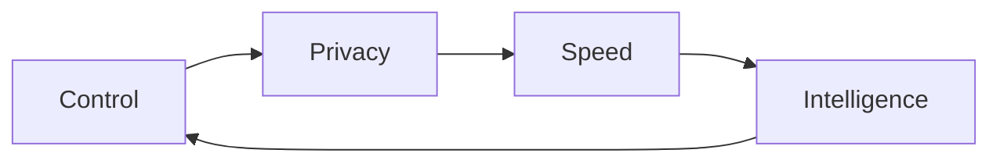
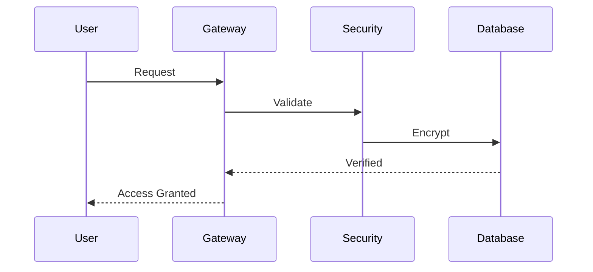

<p align="center">
  
</p>

<p align="center">
  
</p>

<p align="center">
  
  
  
  
</p>

---

## 🧠 What Is **Optimind**?

**Optimind** is a fully engineered **personal intelligence system** — not a chatbot.

It is designed to:

* 🖥️ Run **locally**
* 🔌 Work **offline-first**
* ☁️ Scale **online when needed**
* 🔐 Stay **fully under your control**

> **AI should be owned — not rented.**

---

## 🧬 Design Philosophy



* **Control over execution**
* **Privacy by default**
* **Speed without compromise**
* **Modular intelligence**

---

## 🚀 Newly Added Features

### 🔧 Plugin System

* Dynamic plugin loading & management
* Voice-activated plugin triggers
* Interactive plugin manager (`p` key or voice)
* Hot-reload without restart
* Isolated execution per plugin

### 🎙️ Adaptive Whisper STT

* Smart model selection by audio length
* RAM-aware loading (8GB+ optimized)
* Real-time VAD & silence endpointing

### 🧠 Smart Parser & Automation

* Hybrid LLM routing (local + cloud)
* Automation task detection
* Automatic code execution
* Context-aware responses

### 🛡️ Enhanced Security Layers

* Password guard with secure validation
* Age verification system
* Content filtering
* Secure API session handling

### 📁 File & Data Processing

* CSV analysis & AI reports
* Word clouds with custom masks
* DOCX / PDF generation
* QR code generation

### 🎨 Media Creation Suite

* AI image generation (Pollinations)
* Audio generation (Melody)
* Screen & live camera analysis
* Object detection & recognition

---

## 🧠 System Architecture

flowchart TB
    %% ========== START & AUTHENTICATION ==========
    Start((Start)) --> Auth[Authentication Layer]
    
    subgraph Auth["🔒 Security & Authentication"]
        direction TB
        PW[Password Guard] --> Age[Age Verification]
        Age --> Clap[Clap Detection]
    end
    
    Auth --> Boot[System Boot]
    
    %% ========== CORE SENSOR INPUTS ==========
    Boot --> Sensors
    
    subgraph Sensors["📡 Input Sensors"]
        direction LR
        Microphone[🎤 Voice Input] --> Whisper[Whisper STT]
        Camera[📷 Live Camera] --> YOLO[YOLO Detection]
        Screen[🖥️ Screen Capture] --> OCR[Screen Analysis]
    end
    
    Whisper -->|Adaptive Models<br/>Tiny→Large| STT_Output[Transcribed Text]
    YOLO -->|Object Detection| Vision_Output
    OCR -->|Text Extraction| Screen_Output
    
    STT_Output -->|Speech| InputHub[Input Processing Hub]
    Vision_Output -->|Vision| InputHub
    Screen_Output -->|Screen| InputHub
    
    %% ========== PLUGIN ECOSYSTEM ==========
    InputHub --> PluginRouter[Plugin Router]
    
    subgraph Plugins["🔌 Plugin Ecosystem"]
        direction TB
        
        subgraph MediaPlugins["🎨 Media Plugins"]
            M1[Image Generation]
            M2[QR Code Generator]
            M3[Word Cloud]
            M4[Audio Generation]
            M5[Screen Analysis]
        end
        
        subgraph APIPlugins["🌐 API Integrations"]
            A1[AWS Control]
            A2[Google Services]
            A3[Discord/WhatsApp]
            A4[Slack/Twitter]
            A5[Azure/GitHub]
        end
        
        subgraph UtilityPlugins["🛠️ Utility Plugins"]
            U1[File Operations]
            U2[Data Analysis]
            U3[Web Scraping]
            U4[System Control]
            U5[Security Tools]
        end
        
        subgraph AIPlugins["🤖 AI Services"]
            AI1[OpenAI GPT]
            AI2[Translation]
            AI3[Wikipedia]
            AI4[PDF/OCR]
        end
    end
    
    PluginRouter -->|Media Triggers| MediaPlugins
    PluginRouter -->|API Triggers| APIPlugins
    PluginRouter -->|Utility Triggers| UtilityPlugins
    PluginRouter -->|AI Triggers| AIPlugins
    
    %% ========== CORE AI PROCESSING ==========
    InputHub -->|No Plugin Match| SmartParser[Smart Parser]
    
    subgraph ParserLogic["🧠 Smart Parser Logic"]
        direction TB
        Decision{Is Task Automation?}
        Decision -->|Yes| AutoCode[Auto-Coder Engine]
        Decision -->|No| ChatMode[Chat Mode]
    end
    
    SmartParser --> ParserLogic
    
    %% ========== LLM INTEGRATION ==========
    ChatMode --> LLMRouter[LLM Router]
    
    subgraph LLMs["🧬 Multi-LLM Architecture"]
        direction LR
        
        subgraph Online["⚡ Online (Fast)"]
            Groq[Groq LLaMA 70B]
            Groq -->|API| GroqCloud[Cloud API]
        end
        
        subgraph Offline["💾 Offline (Local)"]
            Local1[DeepSeek Local]
            Local2[Gemma 2B]
            Local3[Custom Models]
        end
    end
    
    LLMRouter -->|Internet Available| Online
    LLMRouter -->|No Internet| Offline
    
    %% ========== EXECUTION & OUTPUT ==========
    AutoCode -->|Python Code| CodeExec[Code Executor]
    MediaPlugins --> MediaExec[Media Engine]
    APIPlugins --> APIExec[API Gateway]
    UtilityPlugins --> UtilExec[Utility Engine]
    AIPlugins --> AIExec[AI Processor]
    LLMs --> ResponseGen[Response Generator]
    
    %% ========== MEMORY & LOGGING ==========
    ResponseGen --> Memory[JSON Memory System]
    CodeExec --> Memory
    MediaExec --> Memory
    APIExec --> Memory
    UtilExec --> Memory
    AIExec --> Memory
    
    Memory --> Logging[📊 Conversation Log]
    
    %% ========== FINAL OUTPUTS ==========
    ResponseGen --> TTS[Typecast TTS Engine]
    MediaExec --> MediaOutput[Media Outputs]
    CodeExec --> Terminal[Terminal Output]
    APIExec --> Network[Network Responses]
    UtilExec --> System[System Changes]
    AIExec --> AIOutput[AI Responses]
    
    TTS -->|Voice| Speaker["🔊 Audio Output"]
    MediaOutput -->|Images/Files| Display["🖼️ Visual Output"]
    Terminal -->|Code Results| Console["💻 Console"]
    Network -->|API Results| Status["📡 Network Status"]
    System -->|Changes| Feedback["🔄 System Feedback"]
    AIOutput -->|Text| ChatDisplay["💭 Chat Display"]
    
    %% ========== FEEDBACK LOOP ==========
    Speaker --> UserFeedback[User Interaction]
    Display --> UserFeedback
    Console --> UserFeedback
    Status --> UserFeedback
    Feedback --> UserFeedback
    ChatDisplay --> UserFeedback
    
    UserFeedback --> Sensors
    
    %% ========== STYLES ==========
    classDef start fill:#2E8B57,stroke:#333,stroke-width:2px,color:#fff
    classDef security fill:#B22222,stroke:#333,stroke-width:1px,color:#fff
    classDef input fill:#4169E1,stroke:#333,stroke-width:1px,color:#fff
    classDef plugin fill:#8A2BE2,stroke:#333,stroke-width:1px,color:#fff
    classDef ai fill:#FF4500,stroke:#333,stroke-width:1px,color:#fff
    classDef llm fill:#20B2AA,stroke:#333,stroke-width:1px,color:#fff
    classDef exec fill:#32CD32,stroke:#333,stroke-width:1px,color:#000
    classDef output fill:#FFD700,stroke:#333,stroke-width:1px,color:#000
    classDef memory fill:#9370DB,stroke:#333,stroke-width:1px,color:#fff
    
    class Start start
    class Auth,PW,Age,Clap security
    class Sensors,Microphone,Camera,Screen,Whisper,YOLO,OCR input
    class Plugins,MediaPlugins,APIPlugins,UtilityPlugins,AIPlugins plugin
    class SmartParser,ParserLogic,Decision ai
    class LLMs,Online,Offline,Groq,Local1,Local2,Local3 llm
    class CodeExec,MediaExec,APIExec,UtilExec,AIExec exec
    class Speaker,Display,Console,Status,Feedback,ChatDisplay output
    class Memory,Logging memory

---

## ⚙️ Intelligence Stack

### 🎙️ Voice Layer

* Adaptive Whisper STT
* Typecast TTS
* Clap detection for hands-free activation

### 🧠 Language Models

**Cloud**

* Groq (LLaMA 70B)

**Local**

* DeepSeek 7B
* Gemma 7B
* LLaMA 8B
* Qwen 7B

Automatic routing based on task & connectivity.

---

## 🔌 Plugin Architecture

* Metadata-based plugins
* Trigger-driven activation
* Isolated execution
* Hot reload
* Plugin manager UI

---

## 🔐 Security Core



* Password protection
* Age verification
* Content filtering
* Local-first data storage


---
## 🏗️ Project Structure

```text
optimind/
├── main.py
├── auto_coder.py
├── memory.py
├── plugin.py
├── api_integrations.py
├── speak.py
├── clap.py
├── age.py
├── pwd_guard.py
├── conversation_memory.json
├── live_camera.py
├── live_screen.py
├── melody.py
├── triggers.py
├── local_llm_exec.py
├── requirements.txt
├── security_db
|   ├── age_guard.db
|   ├── sys_guard.db
├── whisper-cpp
|   ├── whisper-cpp-downloads
└── plugins/
    ├── calculator_plugin.py
    ├── joke_plugin.py
    ├── sample_weather_plugin.py

```

---

## 🔧 Plugin Development

```python
plugin_info = {
    "name": "My Plugin",
    "version": "1.0.0",
    "author": "You",
    "triggers": ["my command"]
}

def plugin_function(text, speak):
    speak("Plugin executed")
    return text
```

---

## 🛠️ Troubleshooting

* **Whisper not found** → Check model paths
* **No audio input** → Verify mic permissions
* **Slow performance** → Use smaller models

---

## 📄 License

Custom License

---

## 🏴 Final Words

This repository is **not a demo**.

It is a **foundation for personal AI sovereignty** — intelligence you own, control, and evolve.

<p align="center">
  
</p>
