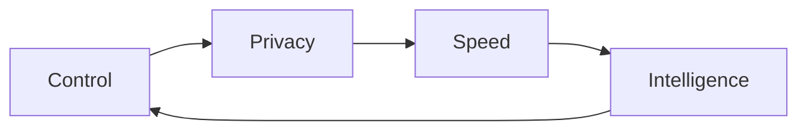
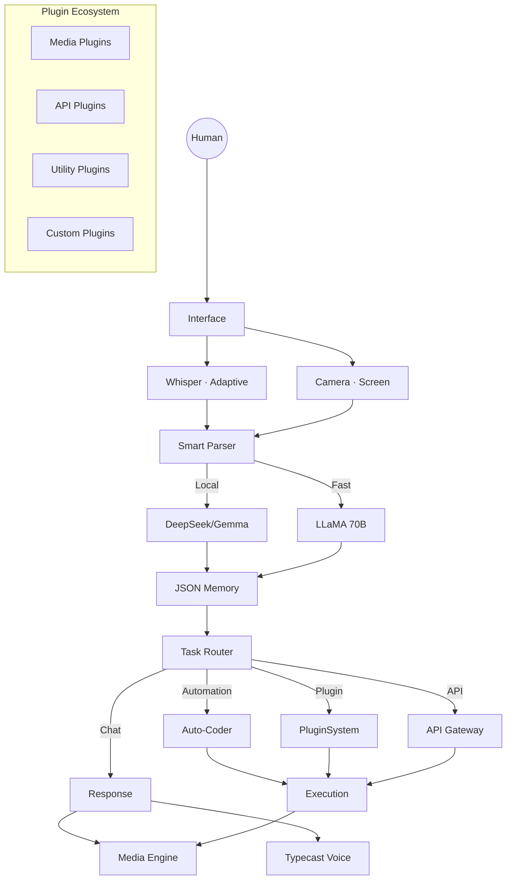
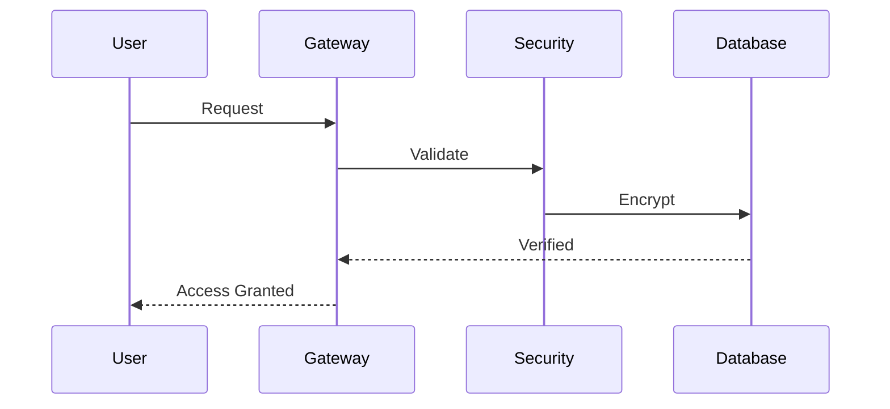

<p align="center">
  
</p>

<p align="center">
  
</p>

<p align="center">
  
  
  
  
</p>

---

## 🧠 What Is **Optimind**?

**Optimind** is a fully engineered **personal intelligence system** — not a chatbot.

It is designed to:

* 🖥️ Run **locally**
* 🔌 Work **offline-first**
* ☁️ Scale **online when needed**
* 🔐 Stay **fully under your control**

> **AI should be owned — not rented.**

---

## 🧬 Design Philosophy



* **Control over execution**
* **Privacy by default**
* **Speed without compromise**
* **Modular intelligence**

---

## 🚀 Newly Added Features

### 🔧 Plugin System

* Dynamic plugin loading & management
* Voice-activated plugin triggers
* Interactive plugin manager (`p` key or voice)
* Hot-reload without restart
* Isolated execution per plugin

### 🎙️ Adaptive Whisper STT

* Smart model selection by audio length
* RAM-aware loading (8GB+ optimized)
* Real-time VAD & silence endpointing

### 🧠 Smart Parser & Automation

* Hybrid LLM routing (local + cloud)
* Automation task detection
* Automatic code execution
* Context-aware responses

### 🛡️ Enhanced Security Layers

* Password guard with secure validation
* Age verification system
* Content filtering
* Secure API session handling

### 📁 File & Data Processing

* CSV analysis & AI reports
* Word clouds with custom masks
* DOCX / PDF generation
* QR code generation

### 🎨 Media Creation Suite

* AI image generation (Pollinations)
* Audio generation (Melody)
* Screen & live camera analysis
* Object detection & recognition

---

## 🧠 System Architecture



---

## ⚙️ Intelligence Stack

### 🎙️ Voice Layer

* Adaptive Whisper STT
* Typecast TTS
* Clap detection for hands-free activation

### 🧠 Language Models

**Cloud**

* Groq (LLaMA 70B)

**Local**

* DeepSeek 7B
* Gemma 7B
* LLaMA 8B
* Qwen 7B

Automatic routing based on task & connectivity.

---

## 🔌 Plugin Architecture

* Metadata-based plugins
* Trigger-driven activation
* Isolated execution
* Hot reload
* Plugin manager UI

---

## 🔐 Security Core



* Password protection
* Age verification
* Content filtering
* Local-first data storage


---
## 🏗️ Project Structure

```text
optimind/
├── main.py
├── auto_coder.py
├── memory.py
├── plugin.py
├── api_integrations.py
├── speak.py
├── clap.py
├── age.py
├── pwd_guard.py
├── conversation_memory.json
├── live_camera.py
├── live_screen.py
├── melody.py
├── triggers.py
├── local_llm_exec.py
├── requirements.txt
├── security_db
|   ├── age_guard.db
|   ├── sys_guard.db
├── whisper-cpp
|   ├── whisper-cpp-downloads
└── plugins/
    ├── calculator_plugin.py
    ├── joke_plugin.py
    ├── sample_weather_plugin.py

```

---

## 🔧 Plugin Development

```python
plugin_info = {
    "name": "My Plugin",
    "version": "1.0.0",
    "author": "You",
    "triggers": ["my command"]
}

def plugin_function(text, speak):
    speak("Plugin executed")
    return text
```

---

## 🛠️ Troubleshooting

* **Whisper not found** → Check model paths
* **No audio input** → Verify mic permissions
* **Slow performance** → Use smaller models

---

## 📄 License

Custom License

---

## 🏴 Final Words

This repository is **not a demo**.

It is a **foundation for personal AI sovereignty** — intelligence you own, control, and evolve.

<p align="center">
  
</p>
