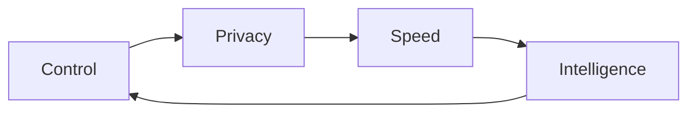
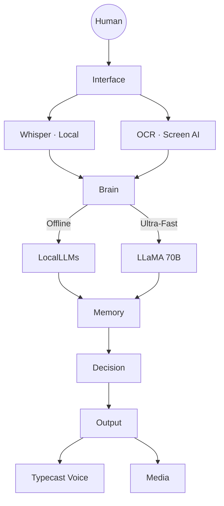
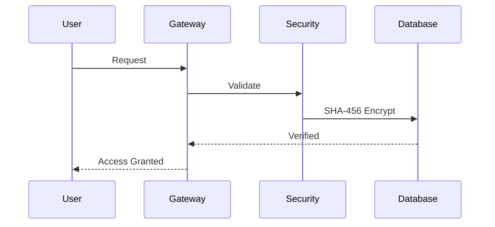

<!-- ============================= -->

<!--  THE ULTIMATE AI — README    -->

<!--  Designed to push GitHub MD -->

<!-- ============================= -->

<p align="center">
  
</p>

<p align="center">
  
</p>

<p align="center">
  
  
  
  
</p>

<p align="center">
  
</p>

---


## 🧠 What Is Optimind?

**Optimind** is a fully‑engineered **personal intelligence system**, not a chatbot.

It is designed to run **locally**, reason **offline**, scale **online when needed**, and remain **under your control at all times**.

This project exists to prove one idea:

> **AI should be owned — not rented.**

---

## 🧬 Design Philosophy



* **Control** over execution
* **Privacy** by default
* **Speed** without compromise
* **Modular intelligence**

---


## 🧠 System Architecture



---

## ⚙️ Intelligence Stack

### 🎙️ Voice Layer

* Realistic **Typecast TTS**
* **OpenAI Whisper STT** (fully local)
* Neural Network **Clap Detection** trigger

---

### 🧠 Language Models

**Cloud (Speed & Reasoning)**

* Groq Infrastructure
* LLaMA 70B

**Offline (Privacy & Control)**

* DeepSeek 7B
* Gemma 7B
* Meta‑LLaMA 8B
* Qwen 7B

> Model routing adapts automatically per task.

---


## 🔐 Zero‑Trust Security



* SQLite secure storage
* SHA‑456 hashing
* Age verification enforcement
* Automatic illegal & adult‑content blocking

---

## 👁️ Visual Intelligence

* OCR Space integration
* Screen awareness
* Contextual summaries
* Proactive risk detection

---

## 🎨 Media Generation Engine

* 🖼️ Images
* 🎬 Video
* 🎧 Audio
* 📊 Word clouds
* 📄 Reports
* 🔳 QR codes

All generated **locally or hybrid**.

---

## 🧠 Memory Core

* JSON‑based persistent memory
* Context preservation
* Local‑first storage

---


## 🧩 API Superstructure

* Cloud & infrastructure APIs
* Communication APIs
* AI processing APIs
* Data & analytics APIs
* Security & network APIs
* System utilities

---

## 🗂️ Project Structure

```bash
optimind/
├── core/
├── voice/
├── vision/
├── security/
├── media/
├── models/
├── database/
├── config/
└── main.py
```

---

## 🚀 Running The System

```bash
pip install -r requirements.txt
python main.py
```
---

## 🏴 Final Words

> **This repository is not a demo.**
> **It is a foundation.**

---

<p align="center">
  
</p>

<!-- END OF README -->
