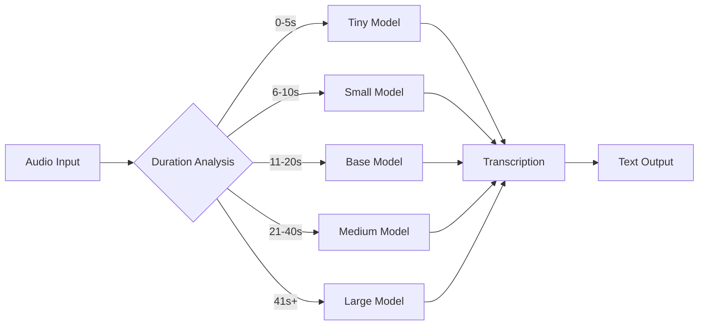

<p align="center">
  
</p>

<p align="center">
  
</p>

<p align="center">
  
  
  
  
</p>

---

## 🧠 What Is **Optimind**?

**Optimind** is a fully engineered **personal intelligence system** — not a chatbot.

It is designed to:

* 🖥️ Run **locally**
* 🔌 Work **offline-first**
* ☁️ Scale **online when needed**
* 🔐 Stay **fully under your control**

> **AI should be owned — not rented.**

---

## 🧬 Design Philosophy


* **Control over execution**
* **Privacy by default**
* **Speed without compromise**
* **Modular intelligence**

---

## 🚀 Newly Added Features

### 🔧 Plugin System

* Dynamic plugin loading & management
* Voice-activated plugin triggers
* Interactive plugin manager (`p` key or voice)
* Hot-reload without restart
* Isolated execution per plugin

### 🎙️ Adaptive Whisper STT

* Smart model selection by audio length
* RAM-aware loading (8GB+ optimized)
* Real-time VAD & silence endpointing

### 🧠 Smart Parser & Automation

* Hybrid LLM routing (local + cloud)
* Automation task detection
* Automatic code execution
* Context-aware responses

### 🛡️ Enhanced Security Layers

* Password guard with secure validation
* Age verification system
* Content filtering
* Secure API session handling

### 📁 File & Data Processing

* CSV analysis & AI reports
* Word clouds with custom masks
* DOCX / PDF generation
* QR code generation

### 🎨 Media Creation Suite

* AI image generation (Pollinations)
* Audio generation (Melody)
* Screen & live camera analysis
* Object detection & recognition

---

## 🧠 System Architecture

```mermaid
flowchart TB
    User((Human)) --> Interface
    Interface --> STT[Whisper · Adaptive]
    Interface --> Vision[Camera · Screen]
    STT --> Brain[Smart Parser]
    Vision --> Brain
    Brain -->|Local| LocalLLMs[DeepSeek/Gemma]
    Brain -->|Fast| Groq[LLaMA 70B]
    
    subgraph "Plugin Ecosystem"
        P1[Media Plugins]
        P2[API Plugins]
        P3[Utility Plugins]
        P4[Custom Plugins]
    end
    
    LocalLLMs --> Memory[JSON Memory]
    Groq --> Memory
    Memory --> Decision[Task Router]
    
    Decision -->|Automation| Code[Auto‑Coder]
    Decision -->|Plugin| PluginSystem
    Decision -->|API| API[API Gateway]
    Decision -->|Chat| Response
    
    Code --> Output[Execution]
    PluginSystem --> Output
    API --> Output
    Response --> TTS[Typecast Voice]
    Response --> Media[Media Engine]
    
    Output --> Media
```



---

## ⚙️ Intelligence Stack

### 🎙️ Voice Layer

* Adaptive Whisper STT
* Typecast TTS
* Clap detection for hands-free activation

### 🧠 Language Models

**Cloud**

* Groq (LLaMA 70B)

**Local**

* DeepSeek 7B
* Gemma 7B
* LLaMA 8B
* Qwen 7B

Automatic routing based on task & connectivity.

---

## 🎤 Voice Recognition System

### 🎯 Adaptive Model Selection


### ⚙️ Configuration Parameters

```python
# Audio processing settings
SAMPLERATE = 16000          # 16kHz sampling rate
CHANNELS = 1                # Mono audio
VOICE_THRESHOLD = 0.015     # Voice detection sensitivity
SILENCE_SECONDS = 1.8       # End-of-speech detection
MIN_SPEECH_SECONDS = 0.5    # Minimum speech duration
```

### 📈 Performance Metrics

```mermaid
graph TD
    subgraph "Performance Matrix"
        A1[Tiny<br/>RAM: 1GB<br/>Speed: ⚡⚡⚡⚡⚡<br/>Accuracy: 85%]
        A2[Small<br/>RAM: 2GB<br/>Speed: ⚡⚡⚡⚡⚡<br/>Accuracy: 88%]
        A3[Base<br/>RAM: 3GB<br/>Speed: ⚡⚡⚡<br/>Accuracy: 91%]
        A4[Medium<br/>RAM: 5GB<br/>Speed: ⚡⚡<br/>Accuracy: 94%]
        A5[Large<br/>RAM: 8GB+<br/>Speed: ⚡<br/>Accuracy: 97%]
    end
    
    subgraph "Best For"
        B1[Short commands<br/><5 seconds]
        B2[Quick questions<br/>6-10 seconds]
        B3[Normal conversation<br/>11-20 seconds]
        B4[Detailed queries<br/>21-40 seconds]
        B5[Complex audio<br/>41+ seconds]
    end
    
    A1 --> B1
    A2 --> B2
    A3 --> B3
    A4 --> B4
    A5 --> B5
    
    style A1 fill:#e1f5e1
    style A2 fill:#d4edda
    style A3 fill:#c3e6cb
    style A4 fill:#b7dfc5
    style A5 fill:#a8d5ba
    style B1 fill:#f8f9fa
    style B2 fill:#f8f9fa
    style B3 fill:#f8f9fa
    style B4 fill:#f8f9fa
    style B5 fill:#f8f9fa
```




---
## 🔌 Plugin Architecture

* Metadata-based plugins
* Trigger-driven activation
* Isolated execution
* Hot reload
* Plugin manager UI

---

## 🔐 Security Core


* Password protection
* Age verification
* Content filtering
* Local-first data storage


---
## 🏗️ Project Structure

```text
optimind/
├── main.py
├── auto_coder.py
├── memory.py
├── plugin.py
├── api_integrations.py
├── speak.py
├── clap.py
├── age.py
├── pwd_guard.py
├── conversation_memory.json
├── live_camera.py
├── live_screen.py
├── melody.py
├── triggers.py
├── local_llm_exec.py
├── requirements.txt
├── security_db
|   ├── age_guard.db
|   ├── sys_guard.db
├── whisper-cpp
|   ├── whisper-cpp-downloads
└── plugins/
    ├── calculator_plugin.py
    ├── joke_plugin.py
    ├── sample_weather_plugin.py

```

---

## 🔧 Plugin Development

```python
plugin_info = {
    "name": "My Plugin",
    "version": "1.0.0",
    "author": "You",
    "triggers": ["my command"]
}

def plugin_function(text, speak):
    speak("Plugin executed")
    return text
```

---

## 🛠️ Troubleshooting

* **Whisper not found** → Check model paths
* **No audio input** → Verify mic permissions
* **Slow performance** → Use smaller models

---

## 📄 License

Custom License

---

## 🏴 Final Words

This repository is **not a demo**.

It is a **foundation for personal AI sovereignty** — intelligence you own, control, and evolve.

<p align="center">
  
</p>
